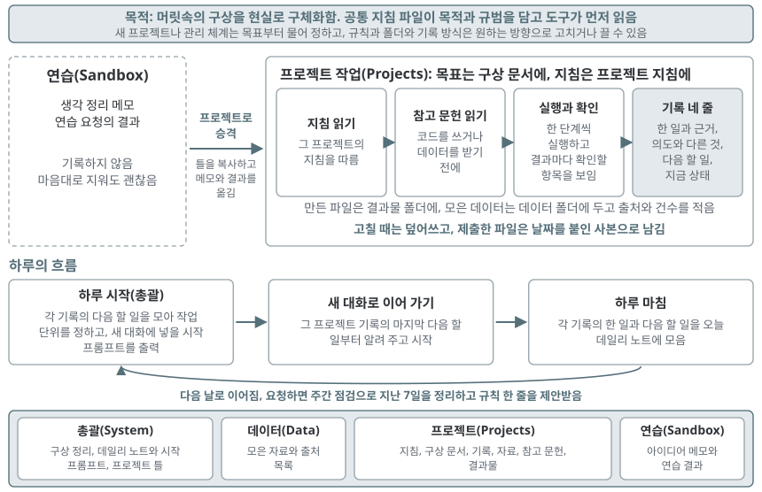

# Your Usable Reality of Ideas - 당신의 구상을 현실로

AI 코딩 도구와 함께 쓰는 개인 작업 공간이다. 이 작업 공간의 목적은 **작업하는 사람의 머릿속에 있는 구상을 현실로 구체화하는 것**이다. 지침, 작업기록, 근거자료(데이터, 참고자료)를 파일로 두어, 새 대화를 열어도 같은 맥락과 근거로 작업을 이어 간다. 이 폴더를 Antigravity IDE 같은 도구로 통째로 열고 쓴다.

- 본 작업 과정 체계가 부담스럽다면 Your Usable Reality of Ideas_Lite를 사용해보세요: https://github.com/pnumksong/Your_Usable_Reality_of_Ideas_Lite
- 특강 자료(발표 PDF): https://github.com/pnumksong/Your_Usable_Reality_of_Ideas/releases/latest

## 다운로드

1. 저장소 화면의 Code 단추에서 Download ZIP을 누르거나 `git clone`으로 다운로드한다.
2. 압축은 바탕화면이나 문서 폴더처럼 짧은 경로에 푼다(Windows는 경로가 너무 길면 파일을 만들지 못함).
3. 이 README가 바로 보이는 폴더를 Antigravity IDE, Claude Code, Codex 같은 도구로 열고(Codex는 이 폴더 맨 위에서 실행해야 지침을 읽음), 첫 요청으로 「이 작업 공간이 어떻게 돌아가는지 설명해 줘」를 넣는다.

## 목적과 규범 체계

| 층 | 어디에 | 정하는 것 |
|---|---|---|
| 작업 공간 전체 | `AGENTS.md`(=`CLAUDE.md`)의 「이 작업 공간의 목적」과 규칙 | 전체 목적과 모든 작업에 공통인 규칙 |
| 프로젝트 | `Projects/이름/01-plan.md`의 「목표」, `00-rules.md` | 그 프로젝트의 목표와 그 프로젝트에만 적용하는 지침 |
| 연습 | `Sandbox/` | 목표와 작업기록 없이 가볍게 해 보는 곳 |

프로젝트 지침은 공통 지침 아래에서 적용한다. 새 프로젝트나 관리 체계를 만들 때는 무엇보다 먼저 그것의 목표를 묻고 적는다.

## 폴더

| 폴더 | 하는 일 |
|---|---|
| `AGENTS.md`, `CLAUDE.md` | 공통 지침. 도구가 작업을 시작할 때 먼저 읽는다. 두 파일은 내용이 같다(Antigravity IDE와 Codex는 AGENTS.md, Claude Code는 CLAUDE.md를 읽음) |
| `System/` | 전체 목록(`Overview.md`), 데일리 노트(`Daily/`), 주간 점검(`Weekly/`, 처음 점검할 때 생김), 새 프로젝트의 틀(`Templates/Project/`) |
| `Data/` | 근거자료 중 모은 데이터. 여러 프로젝트가 함께 쓰고, 파일마다 출처와 다운로드한 날과 건수를 `Data/README.md`에 적는다 |
| `Projects/` | 프로젝트마다 폴더 하나. 지침 `00-rules.md`, 구상 문서 `01-plan.md`, 작업기록 `02-log.md`, 데이터 `data/`, 참고자료 `reference/`, 결과물 `output/`. 처음에는 비어 있다 |
| `Sandbox/` | 연습과 생각 정리, 예시 프로젝트 넷(`examples/`). 작업기록을 남기지 않고 지워도 된다 |

## 작업 수행 구조

1. 도구가 공통 지침을 먼저 읽고, 요청에 프로젝트 폴더를 밝히면 그 프로젝트의 목표와 지침을 따른다.
2. 코드를 쓰거나 데이터를 다운로드하기 전에 근거자료를 먼저 확인한다.
   - 데이터: `Data/`와 프로젝트의 `data/`
   - 참고자료: 프로젝트의 `reference/`에 둔 가이드와 지침, 논문 등
3. 파일을 수정하기 전에 예상되는 변화와 파급 효과를 설명하고 승인을 요청하며, 체계 수정을 비롯한 주요 작업은 계획을 먼저 올려 작업자의 승인을 받는다.
4. 한 번에 한 단계씩 실행하고 결과마다 확인할 항목을 보이며, 만든 파일은 `output/`, 모은 데이터는 `Data/`에 둔다.
5. 작업이 끝나면 `02-log.md`에 네 줄(한 일, 의도에서 벗어난 점, 다음 할 일, 지금 상태)의 작업기록을 남긴다.
   - 「한 일」에는 판단의 근거로 쓴 데이터와 참고자료, 앞선 작업기록의 위치를 함께 적어 나중에 그 근거를 다시 열어 볼 수 있게 한다.
6. 새 대화를 열면 그 프로젝트 작업기록의 마지막 「다음 할 일」부터 이어 간다.

- 하루의 시작과 마침, 새 프로젝트 만들기와 승격, 주간 점검은 한 대화(총괄 대화)에서 하고, 실제 작업은 총괄이 써 준 시작 프롬프트를 붙여 넣은 새 대화에서 한다.
  - 하루 시작: 최근 데일리 노트와 각 작업기록의 다음 할 일을 모아 오늘 노트와 작업 단위별 시작 프롬프트를 만든다.
  - 하루 마침: 한 일과 다음 할 일을 오늘 노트에 모은다.
- 월요일에 하루를 시작할 때 총괄이 주간 점검을 함께 한다(기본값이며, 요일을 바꾸거나 끌 수 있음).
  - 지난 7일의 데일리 노트와 작업기록을 읽고 끝난 것, 밀린 일, 되풀이된 「의도에서 벗어난 점」, 한동안 쓰지 않은 프로젝트, 남긴 제출본을 정리한다.
  - 밀린 일의 처리 방안과 규칙 보완사항을 제안하고, 작업자가 승인한 것만 반영한다.

## 참조와 역참조

- 프로젝트가 그 폴더 밖의 것을 근거로 쓰면 작업기록에 참조를 달고 상대 쪽에도 이 프로젝트가 쓴다는 표시를 남긴다.
  - 데이터 폴더의 파일: `Data/README.md`의 「쓰는 프로젝트」 칸
  - 다른 프로젝트의 파일: 그 프로젝트의 작업기록
  - 외부 주소와 참고자료: 이 프로젝트의 `reference/README.md`
- 참조를 바꾸거나 지울 때는 상대 쪽 표시도 함께 고치며, Sandbox는 참조 대상이 아니다.

## 버전 컨트롤

- 작업 중인 파일은 덮어써서 고친다.
- 제출했거나 남에게 보낸 파일은 고치기 전에 `output/versions/YYYY-MM-DD-원래이름`으로 그날의 사본을 남기고, 무엇을 어디에 냈는지 작업기록을 남긴다.
- 날짜마다 사본을 남기고 싶으면 `AGENTS.md`(와 `CLAUDE.md`)의 「자기 규칙」에 한 줄 적어 둔다.

## 연습 모드와 정식 프로젝트 승격

- `Sandbox/`에서는 부담 없이 해 보고 지우며, 예시 프로젝트 넷도 `Sandbox/examples/`에 있다.
- 프로젝트의 작업은 `Sandbox/`를 참조하지 않으므로, Sandbox에 있는 것을 쓰려면 먼저 승격한다.
- 승격 요청 예: 「Sandbox/examples의 ○○를 프로젝트로 승격해 줘」, 「Sandbox의 ○○ 메모와 practice의 ○○ 폴더를 프로젝트로 승격해 줘. 프로젝트 이름은 ○○」
- 승격은 다음 순서로 진행된다.
  - 도구가 목표를 먼저 묻고 승격 계획을 올린다.
  - 승인을 받으면 프로젝트를 만들어 메모와 결과를 옮긴다.
  - 그 연습이 참조하던 자료와 새 프로젝트가 서로를 가리키도록 작업기록과 목록에 적고, Sandbox의 원래 자리에는 승격한 곳을 남긴다.

## 체계 수정

- 이 지침, 폴더, 작업기록 방식, 프로젝트 틀은 모두 기본값이며, 작업자의 의도와 상황에 따라 구조를 얼마든지 수정할 수 있다.
- 도구에 수정을 요청하는 경우 도구는 예상되는 변화와 파급 효과를 설명하고 승인을 요청한다.
- 체계 수정을 비롯한 주요 작업은 바로 진행하지 않고, 도구가 계획을 먼저 올리고 작업자가 직접 승인한 뒤 진행한다.
- 프로젝트 단위의 지침과 작업기록이 필요 없으면 그 규칙을 끄고 가볍게 써도 된다.
- 끝났거나 그만둔 프로젝트는 전체 목록의 상태를 「닫음」으로 바꾸고 폴더를 `Projects/_closed/`로 옮겨 닫는다.

## 시작해보기

- 「이 작업 공간에서 지침, 작업기록, 데일리 노트, 연습 폴더가 어떻게 이어져 작업이 돌아가는지 설명해 줘」
- 「새 프로젝트를 만들고 싶어. 목표부터 물어봐 줘」
- 「하루를 시작하자. 오늘 데일리 노트를 만들고, 할 일을 작업 단위로 나눠 새 대화에 넣을 시작 프롬프트를 써 줘」

## 유의사항

- 인증키는 그 프로젝트의 `data/` 안 키 파일에만 두고 요청이나 화면에 쓰지 않으며, 코드가 실행할 때만 읽게 한다.
- 코드를 처음 실행하기 전에 도구가 권장 설치 항목(Python 등)을 확인해 묻고, 설치를 원하지 않으면 설치 없이 하는 방법을 함께 정한다.
- 만든 화면은 HTML 파일이라 파일로 공유할 수 있다.
- 외부에서 LLM과 연결해 쓰려면 키를 24시간 켜 둔 서버 쪽에 두고 호출량과 토큰 비용을 관리하거나, 오픈 소스 LLM을 직접 돌리는 장치가 필요하다.

## 감사의 말

본 작업 폴더의 구상은 넥스트 제너레이션 아키비스트 클럽에서 시작하였으며, 스터디를 운영하고 아이디어를 주신 [ContextA](https://contexta.co.kr/)의 정혜지 대표님께 감사드립니다.
